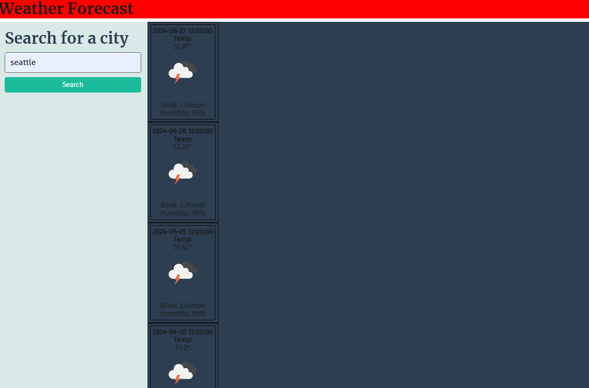

# weather_forecast

website can be access via: https://imgonnagoafk.github.io/weather_forecast/

## Description
  This was created as a weather application that tracks using OpenWeatherMap API based on the city that is entered. Forecast for the next 5 days are shown as well as an icon of what the weather is like.

## Credit
    Starter code was provided by UNCC bootcamp and editted by Kevin Hoang